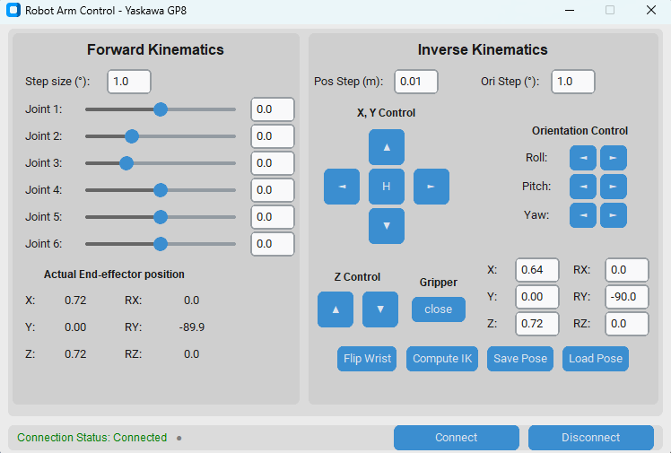

# Yaskawa GP8 Robot Controller

A Python-based interface for controlling the Yaskawa GP8 robot arm through both forward and inverse kinematics. This application provides a modern GUI for robot manipulation and connects to CoppeliaSim for simulation.



## Project Overview

This application allows users to control a Yaskawa GP8 robot arm with 6 degrees of freedom. It provides:

- Real-time control through an intuitive graphical interface
- Forward kinematics (FWK) control for direct joint manipulation
- Inverse kinematics (IK) control for end-effector positioning
- Connection to CoppeliaSim simulation environment
- Gripper control functionality
- Pose saving and loading capabilities

## Module Descriptions

The project consists of several core modules:

- **GUI_Controller.py**: The main graphical user interface built with CustomTkinter for robot control
- **ik_solver.py**: Implementation of inverse kinematics algorithms using numerical optimization
- **fwk_solver.py**: Forward kinematics solver using Denavit-Hartenberg parameters
- **coppeliasim_interface.py**: Interface layer for communication with CoppeliaSim robot simulation environment

## Installation

1. Clone this repository:
   ```
   git clone https://github.com/yourusername/YaskawaGP8_Controller.git
   cd YaskawaGP8_Controller
   ```

2. Install required packages:
   ```
   pip install customtkinter numpy scipy sympy opencv-python
   ```

3. Install CoppeliaSim from [coppeliarobotics.com](https://www.coppeliarobotics.com/downloads)

4. Install the CoppeliaSim Remote API:
   ```
   pip install coppeliasim-zmqremoteapi-client
   ```

## Usage

1. Launch CoppeliaSim and load the Yaskawa GP8 scene
2. Run the GUI Controller:
   ```
   python GUI_Controller.py
   ```
3. Click "Connect" to establish a connection with CoppeliaSim
4. Use either the Forward Kinematics sliders or Inverse Kinematics controls to manipulate the robot

## Demo Video

Here's a short demonstration of the controller in action:

https://github.com/yourusername/YaskawaGP8_Controller/raw/main/docs/GUIdemo.mp4

## Mathematical Background

The controller uses:
- DH parameters for kinematic model representation
- Numerical optimization for solving the inverse kinematics problem
- Euler angle conversions for end-effector orientation control
